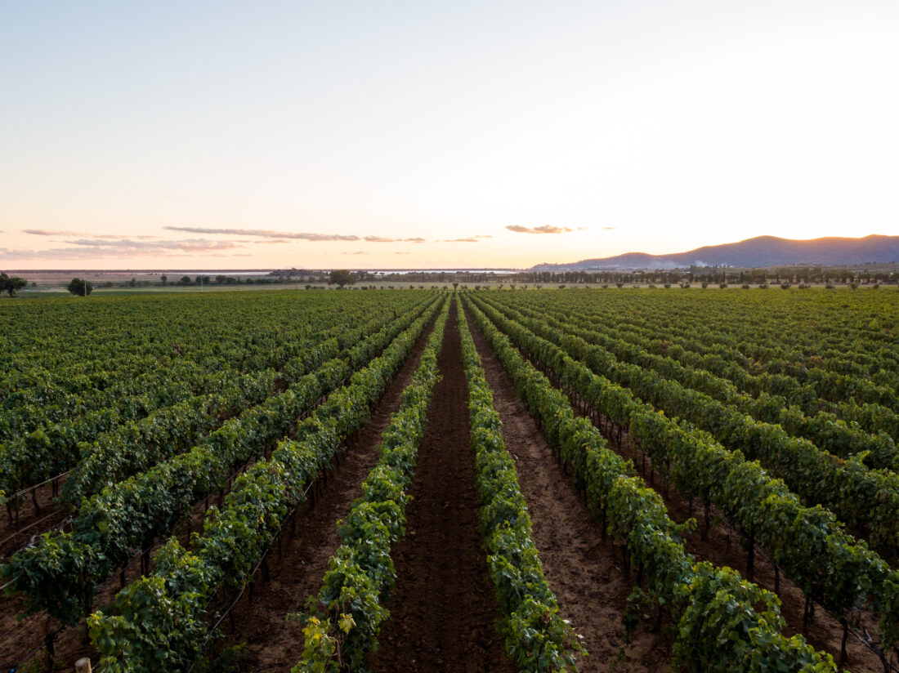
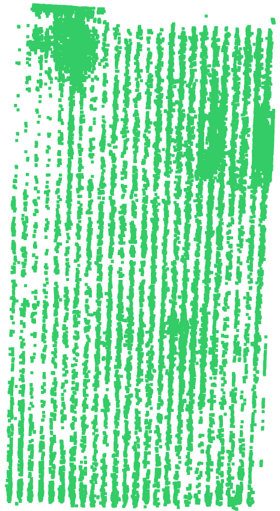
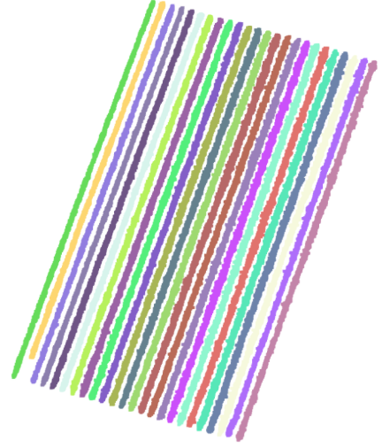

# Vegetation Point Cloud Analysis

> Automated pipeline for extracting vegetation metrics from multispectral LiDAR point clouds



## Overview

This project processes multispectral LiDAR data to extract quantitative metrics from agricultural vegetation (vineyards, olive groves). The pipeline handles ground removal, plant segmentation, volume estimation, and NDVI calculation.

## Pipeline

### Ground Removal
SMRF-based ground classification to isolate vegetation from terrain.



### Clustering & Segmentation
DBSCAN-based instance segmentation to identify individual plants from point clouds.



### Volume Estimation
- Voxelization for robust approximation
- Slicing method for detailed measurements
- Open3D integration for 3D processing

### NDVI Calculation
Multispectral band processing to compute vegetation indices, exported as GeoTIFF for GIS analysis.

## Tech Stack

- **Point Cloud Processing**: Open3D, laspy
- **Clustering**: DBSCAN, scikit-learn
- **Geospatial**: GDAL, rasterio
- **Deployment**: Azure Batch (containerized pipeline)

## Structure

```
├── scripts/          # Core processing modules
├── azure_platform/   # Cloud deployment configs
└── images/           # Pipeline visualizations
```

## Usage

Run the full pipeline via Azure Batch:
```bash
cd azure_platform
./run_all.sh
```

Or execute individual stages locally from `scripts/`.
