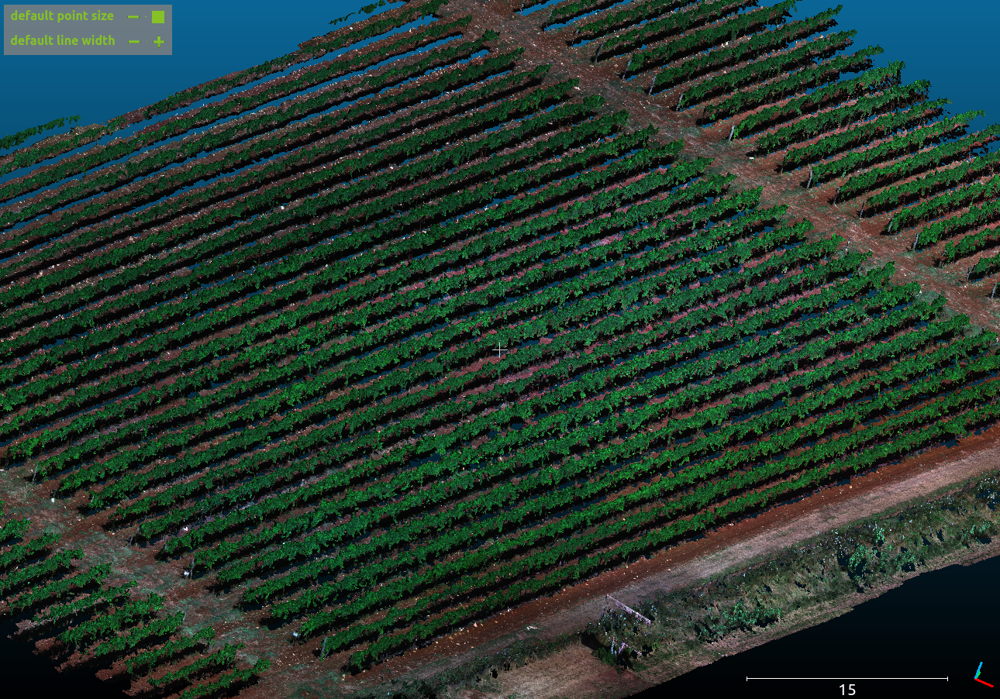
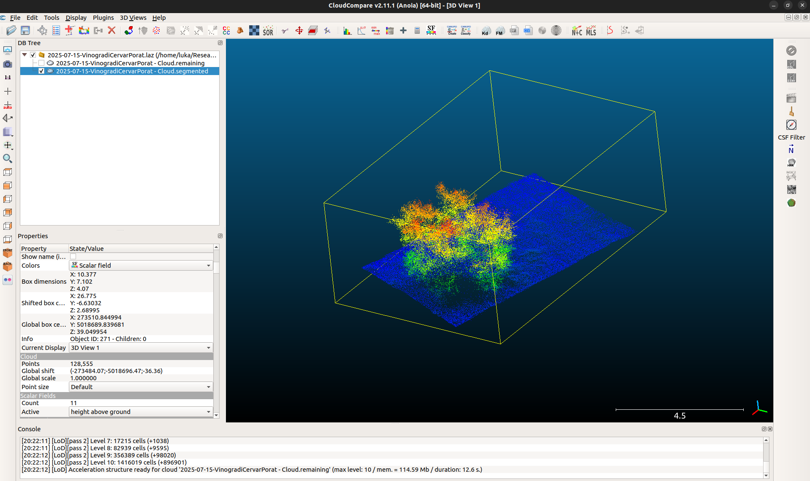

# Vegetation Point Cloud Analysis

> Automated pipeline for extracting vegetation metrics from multispectral LiDAR point clouds for vineyard analysis



## Overview

This project processes multispectral LiDAR and infrared point cloud data to extract quantitative vegetation metrics for precision agriculture, with a focus on vineyard analysis. The pipeline supports both local execution and an Azure-native deployment, and covers the full workflow from raw LAS/LAZ files to row-level feature outputs.

Main outputs include:

- ground / non-ground classification
- plant and row segmentation
- NDVI calculation from multispectral bands
- volume estimation using multiple geometric methods
- temperature and quality-control metrics
- Parquet-based feature tables for downstream analytics

The overall data flow is:

`Raw LAS/LAZ → Ground Removal → Clustering / Segmentation → NDVI / Volume Features → Parquet Output`

---

## Pipeline

### Ground Removal

Ground points are removed using the **SMRF (Simple Morphological Filter)** algorithm through PDAL. This step separates terrain from vegetation and prepares the point cloud for downstream segmentation.

Key script:
- `scripts/smrf_ground_classification.py`

Features:
- PDAL Python bindings support
- CLI fallback when bindings are unavailable
- terrain-adaptive filtering with configurable SMRF parameters


### Clustering & Segmentation

Vegetation points are segmented into individual plants or vine sections using point cloud clustering. The production implementation is written in **C++ with PCL**, using Euclidean clustering for performance and scalability.

Key script:
- `scripts/clustering_only.cpp`

Features:
- Euclidean cluster extraction with PCL
- optional voxel downsampling
- outlier removal before clustering
- support for parameter sweeps and cluster export


### Volume Estimation

The repository includes several approaches for canopy volume estimation, allowing comparison between speed, robustness, and geometric precision.

Implemented methods include:
- **Voxel-based volume** for fast approximation
- **Slicing-based volume** for structured analysis
- **Convex hull volume** as a simple baseline
- **Polynomial envelope fitting** for analytically integrated slice areas
- **Alpha-shape / concave hull methods** for complex plant geometry

Volume-related notebooks:
- `enhanced_volume_calculation.ipynb`
- `polynoms_volume_calculation.ipynb`
- `read_plot_voxelization.ipynb`

### NDVI Calculation

NDVI is computed directly from multispectral point cloud attributes using the standard formula:

`NDVI = (NIR - Red) / (NIR + Red)`

Key script:
- `scripts/pcd_to_ndvi_las.py`

Features:
- multispectral LAS/LAZ support
- NDVI export as an extra LAS dimension
- preservation of original point cloud attributes
- per-row vegetation health analysis

### Feature Extraction

The final stage aggregates geometric and spectral properties into analysis-ready outputs.

Extracted features include:
- NDVI statistics
- row / cluster bounding boxes
- voxel, slice, hull, and polynomial volume estimates
- temperature summaries from infrared data
- quality-control and disagreement metrics across methods

---

## Methods and Algorithms

### SMRF Ground Classification

Ground removal uses PDAL’s SMRF filter with configurable slope, window, threshold, and scalar parameters. This provides robust terrain separation in agricultural scenes with uneven ground.

### PCL Euclidean Clustering

The main clustering implementation uses `pcl::EuclideanClusterExtraction` for high-performance segmentation. It is designed for production use and supports filtering, downsampling, and batch parameter evaluation.

### Polynomial Slice-Based Volume

The polynomial method estimates canopy volume by:

1. slicing the point cloud along the Z axis  
2. splitting each slice along Y  
3. extracting upper and lower envelopes along X  
4. fitting adaptive quadratic or cubic polynomials  
5. analytically integrating the area between curves  
6. summing slice areas across height  

This method is the most geometrically detailed approach in the repository.

### Alpha Shape Volume Estimation

The enhanced volume workflow uses slice-wise clustering and 2D alpha shapes to reconstruct concave boundaries. Polygon area is computed exactly with the shoelace formula, making this approach robust for irregular vegetation structure.

### Deep Learning / Research Components

The repository also contains an experimental point cloud transformer autoencoder pipeline for learned point cloud representation and segmentation research.

Key file:
- `pointcloud_transformer_autoencoder.py`

---

## Data

Example source data is organized under:

```text
/datasource/flights/
```

Typical inputs include:
- `07-15-MS.laz` — July multispectral point cloud
- `08-19-MS.laz` — August multispectral point cloud
- `07-15-LIDAR.laz` — July LiDAR acquisition
- `2025-07-15-IR.laz` — infrared / thermal point cloud

The project follows a lakehouse-style layout:

```text
bronze/   # Raw immutable data
silver/   # Intermediate processed outputs
gold/     # Final feature tables and metrics
```

---

## Azure Platform

The `azure_platform/` directory contains a cloud-native version of the pipeline designed for scalable execution on Azure.

It includes:
- Docker-based containerization
- Azure Data Lake Storage Gen2 integration
- job-oriented execution for pipeline stages
- environment-variable configuration
- success markers (`_SUCCESS.json`) for orchestration and handoff

This version is intended for large-scale or repeatable processing workloads where local execution is not sufficient.

---

## Tech Stack

### Python
- `numpy`
- `pandas`
- `pyarrow`
- `laspy`
- `open3d`
- `pypcd4`

### C++ / Geospatial
- `PCL`
- `PDAL`
- `CMake`

### Cloud / Deployment
- `Docker`
- `Azure Data Lake Storage Gen2`
- `Azure Container Apps`
- `azcopy`

---

## Repository Structure

```text
├── scripts/                          # Core processing scripts
│   ├── smrf_ground_classification.py
│   ├── clustering_only.cpp
│   └── pcd_to_ndvi_las.py
├── azure_platform/                   # Azure-native pipeline components
├── images/                           # README and visualization assets
├── enhanced_volume_calculation.ipynb # Alpha-shape and advanced volume analysis
├── polynoms_volume_calculation.ipynb # Polynomial envelope volume estimation
├── read_plot_voxelization.ipynb      # Voxelization experiments and plotting
├── visualize_parquet.ipynb           # Output inspection and visualization
└── pointcloud_transformer_autoencoder.py
```

---

## Usage

### Azure pipeline

Run the cloud pipeline from the Azure deployment directory:

```bash
cd azure_platform
./run_all.sh
```

### Local execution

Individual stages can also be run locally from the `scripts/` directory, depending on the data and environment available:

- ground classification with PDAL / SMRF
- clustering and segmentation with PCL
- NDVI generation from multispectral LAS/LAZ
- notebook-based experimentation for volume estimation and analysis

---

## Outputs

Typical outputs include:
- filtered ground / non-ground point clouds
- cluster-level point cloud files
- row-level and plant-level feature tables
- Parquet datasets for downstream analytics
- NDVI-enriched LAS outputs
- volume comparison metrics across methods

These outputs are designed for:
- vineyard health monitoring
- canopy structure analysis
- yield estimation
- temporal comparison across acquisitions
- precision agriculture workflows

---

## Research and Development

In addition to the production pipeline, the repository includes notebooks and generators for testing and method development.

Examples:
- synthetic point cloud generation for controlled experiments
- comparison of multiple volume estimation strategies
- visualization of processed Parquet outputs
- exploration of learning-based point cloud models




---

## Project Goal

The goal of this project is to build a reliable and scalable pipeline for extracting per-row vegetation metrics from multispectral point clouds. It combines classical geospatial processing, high-performance point cloud segmentation, and cloud deployment to support large-scale agricultural analysis.
