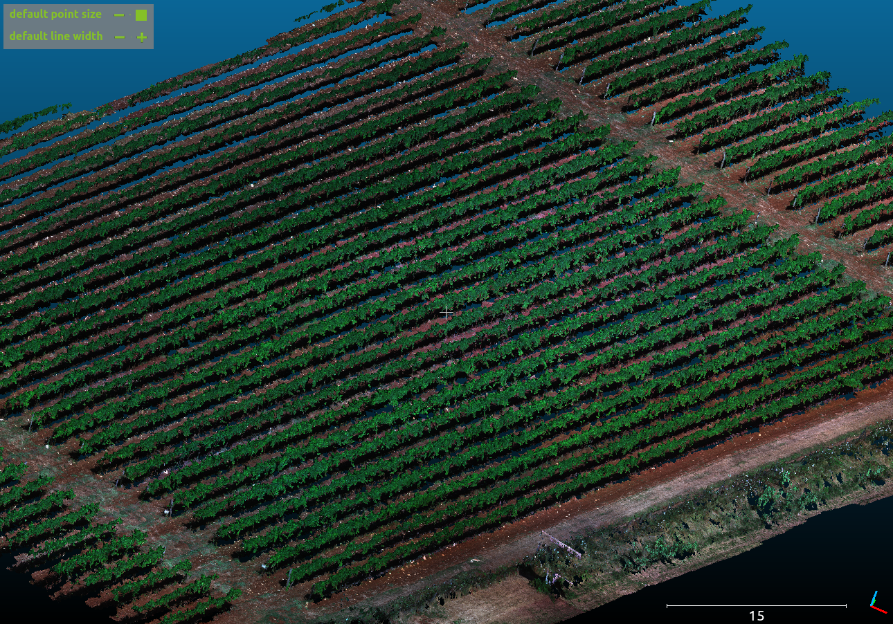
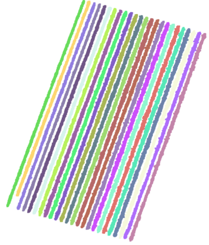
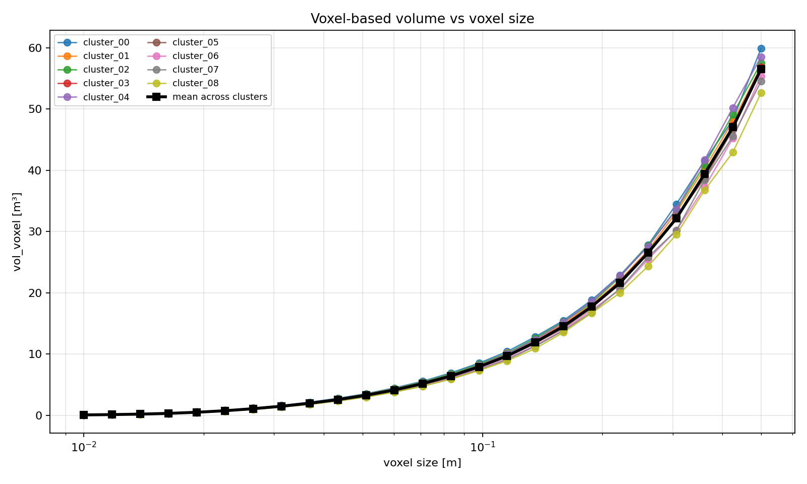
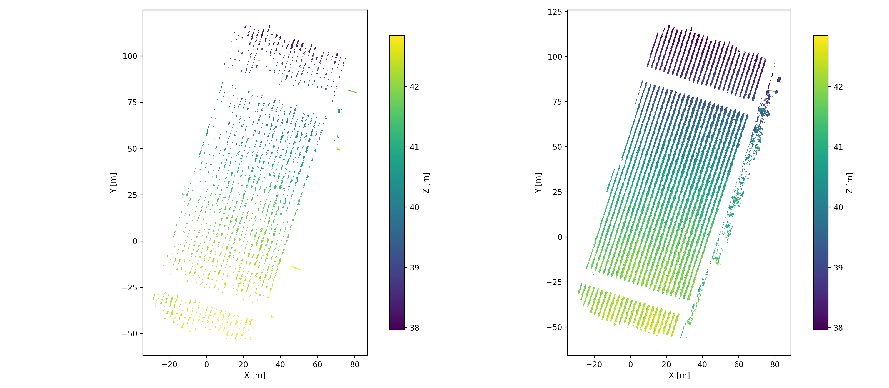
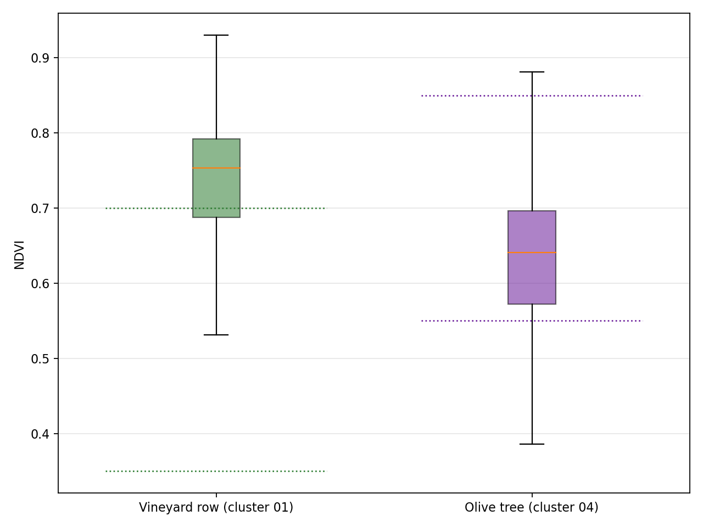
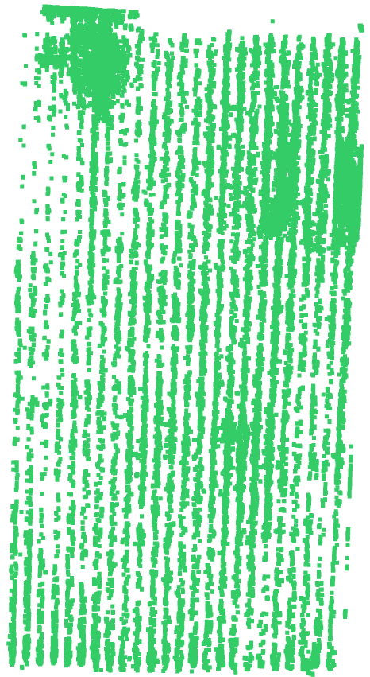
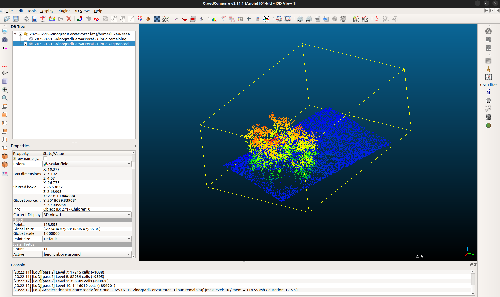

# Vegetation Point Cloud Analysis

> Automated pipeline for extracting per-row vegetation metrics from multispectral
> LiDAR / drone point clouds for precision viticulture.



## What is in this repository?

This repo turns a raw multispectral LAS/LAZ point cloud of a vineyard (or olive
grove) into an analysis-ready table of **per-row vegetation metrics** — NDVI,
canopy volume, height, geometry and temperature. It contains four things:

| # | Component | Folder | What it is |
|---|-----------|--------|------------|
| 1 | **Processing pipeline** | [`scripts/`](scripts/) | The core scripts (Python + C++) and the experiments/notebooks behind the thesis. Run end-to-end with [`scripts/run_pipeline.sh`](scripts/run_pipeline.sh). |
| 2 | **Web app** | [`vineyard_app/`](vineyard_app/) | Upload a `.las`, the backend runs the pipeline, the frontend renders the clustered rows in an interactive 3D viewer with metric tables. |
| 3 | **Cloud deployment** | [`azure_platform/`](azure_platform/) | The same pipeline split into 3 containerised jobs for scalable execution on Azure. |
| 4 | **Documentation & assets** | [`docs/`](docs/), [`images/`](images/), [`research_papers/`](research_papers/) | Method report, figures, and the reference papers. |

The data flow end-to-end:

```text
Raw LAS/LAZ ──► Ground removal (SMRF) ──► Clustering / row segmentation (PCL)
            ──► NDVI tagging ──► Per-row feature extraction ──► row_features.parquet
```

---

## Table of contents

- [Repository structure](#repository-structure)
- [Quick start](#quick-start)
  - [Run the full pipeline locally](#run-the-full-pipeline-locally)
  - [Run the web app](#run-the-web-app)
  - [Run on Azure](#run-on-azure)
- [The `scripts/` directory, grouped by purpose](#the-scripts-directory-grouped-by-purpose)
  - [`pipeline/` — production pipeline modules](#pipeline--production-pipeline-modules)
  - [`clustering/` — C++ / PCL clustering](#clustering--c--pcl-clustering)
  - [`volume/` — volume estimation & validation](#volume--volume-estimation--validation)
  - [`analysis/` — comparisons & spectral analysis](#analysis--comparisons--spectral-analysis)
  - [`visualization/` — result viewers](#visualization--result-viewers)
  - [`ml/` — learned representations](#ml--learned-representations)
  - [`synthetic/` — synthetic data generator](#synthetic--synthetic-data-generator)
  - [`alternatives/` — earlier / experimental approaches](#alternatives--earlier--experimental-approaches)
- [Pipeline stages explained](#pipeline-stages-explained)
- [Methods and algorithms](#methods-and-algorithms)
- [Configuration](#configuration)
- [Data layout](#data-layout)
- [Tech stack](#tech-stack)
- [Outputs](#outputs)
- [Project goal](#project-goal)

---

## Repository structure

```text
vegetation-pcd-analysis/
├── scripts/                     # Processing pipeline + experiments
│   ├── run_pipeline.sh          # ► End-to-end pipeline entry point
│   ├── run_features.sh          # ► Feature-only re-run (reuses cluster LAS)
│   ├── pipeline/                # Core, importable production modules
│   ├── clustering/              # C++ / PCL Euclidean clustering (CMake build)
│   ├── volume/                  # Volume estimation: sensitivity + validation
│   ├── analysis/                # SMRF/RANSAC & NDVI/species comparisons
│   ├── visualization/           # Result viewers (notebooks + scripts)
│   ├── ml/                      # Point-cloud transformer autoencoder (research)
│   ├── synthetic/               # Synthetic point-cloud generator
│   ├── alternatives/            # Earlier / experimental approaches
│   └── out_ground|out_cluster|out_cluster_las/   # Pipeline outputs (gitignored)
├── vineyard_app/                # FastAPI + React web app over the pipeline
├── azure_platform/              # Containerised 3-job pipeline for Azure
├── segmentation_baseline/       # Learning-based segmentation baseline
├── docs/                        # Method report (canopy structure)
├── images/                      # README figures and result plots
├── research_papers/             # Reference literature
└── README.md
```

> **Note on running scripts.** The core production modules live in
> `scripts/pipeline/`. The entry scripts `run_pipeline.sh` / `run_features.sh`
> stay at the top of `scripts/` (the web app and Azure jobs call them by that
> path) and invoke the pipeline modules via `pipeline/…`. Analysis/volume
> scripts that reuse a production module add `scripts/pipeline/` to `sys.path`
> automatically, so they run from anywhere.

---

## Quick start

### Run the full pipeline locally

Requires Python 3.10+, PDAL, PCL and CMake (see [Tech stack](#tech-stack)).

```bash
cd scripts
./run_pipeline.sh ../datasource/flights/2025-07-15-MS_Vinograd_1.las
```

This runs all six stages and produces, in `scripts/out_cluster_las/`:

- `row_features.parquet` — per-row metrics (volumes, NDVI, height, geometry)
- `merged.las` — merged NDVI-tagged point cloud

The first run configures and builds the C++ clustering target automatically
(`scripts/clustering/build/`). To recompute only the feature tables from
existing cluster LAS files:

```bash
cd scripts
./run_features.sh ../datasource/flights/2025-07-15-MS_Vinograd_1.las
```

### Run the web app

See [`vineyard_app/README.md`](vineyard_app/README.md). The backend runs
`scripts/run_pipeline.sh` per upload and serialises jobs; the frontend renders
the clustered rows in 3D with metric tables.

### Run on Azure

See [`azure_platform/README.md`](azure_platform/README.md):

```bash
cd azure_platform
./run_all.sh --input ../datasource/flights/07-15-MS.laz
```

---

## The `scripts/` directory, grouped by purpose

### `pipeline/` — production pipeline modules

The core, importable modules that `run_pipeline.sh` / `run_features.sh` drive.

| File | Role |
|------|------|
| `pipeline_config.py` | Loads `pipeline_config.env` and exposes typed constants (SMRF, clustering, volume, NDVI, RANSAC). Single source of truth for tunables. |
| `smrf_ground_classification.py` | SMRF ground/non-ground separation via PDAL (Python bindings, CLI fallback). |
| `pcd_to_ndvi_las.py` | Tags each cluster PCD with NDVI and writes it back out as LAS. |
| `compute_row_features.py` | Per-row geometric & radiometric features → `row_features.parquet` (voxel/slice/hull/polynomial volumes, NDVI stats, bbox, temperature). |
| `compute_canopy_structure.py` | Segment-based canopy structure metrics (porosity, gap fraction, Beer–Lambert LAI proxy). |
| `merge_las_points.py` | LAS merge helper utility. |

### `clustering/` — C++ / PCL clustering

| File | Role |
|------|------|
| `clustering_only.cpp` | Production Euclidean clustering (`pcl::EuclideanClusterExtraction`) with optional voxel downsampling and outlier removal. |
| `CMakeLists.txt` | Build definition (also builds the experimental C++ targets in `../alternatives/`). |
| `clustering_params.txt` | Reference notes for clustering parameters. |

Build manually if needed:

```bash
cmake -S scripts/clustering -B scripts/clustering/build -DCMAKE_BUILD_TYPE=Release
cmake --build scripts/clustering/build -j
```



### `volume/` — volume estimation & validation

Canopy-volume methods plus the sensitivity and synthetic-validation studies.

| File | Role |
|------|------|
| `volume_sensitivity.py` | Sweeps voxel size / alpha radius for the production volume estimators. |
| `volume_sensitivity_experiment.py` | Extended sensitivity experiment (incl. convex-hull baseline, hole-filling). |
| `lai_voxel_size_sensitivity.py` | Voxel-size sensitivity of the Beer–Lambert LAI proxy. |
| `synthetic_volume_validation.ipynb` | Validates estimators on synthetic clouds of **known** volume. |
| `synthetic_volume_validation_extra.ipynb` | Additional synthetic scenes (two-row, olive grove). |
| `polynoms_volume_calculation.ipynb` | Polynomial envelope volume estimation. |
| `enhanced_volume_calculation.ipynb` | Alpha-shape / concave-hull volume estimation. |
| `voxelization.ipynb`, `read_plot_voxelization.ipynb` | Voxelization experiments and plotting. |



### `analysis/` — comparisons & spectral analysis

| File | Role |
|------|------|
| `compare_smrf_ransac.py` | SMRF (default vs tuned) vs single-plane RANSAC ground-fit comparison figures. |
| `compare_ndvi_species.py` | NDVI distribution comparison across species. |
| `inspect_laz_files.ipynb` | Quick inspection of LAS/LAZ contents. |




### `visualization/` — result viewers

| File | Role |
|------|------|
| `visualize_row_metrics.ipynb` | Visualises the per-row metrics in `row_features.parquet`. |
| `visualize_tutorial_clusters.py` | Renders clustering results. |

### `ml/` — learned representations

| File | Role |
|------|------|
| `pointcloud_transformer_autoencoder.py` | Experimental transformer autoencoder for learned point-cloud representation. |
| `ae_downsample_reconstruct_demo.py` | Downsample-and-reconstruct demo using the autoencoder. |

### `synthetic/` — synthetic data generator

| File | Role |
|------|------|
| `objct_generator.py` | Generates synthetic point-cloud objects for controlled tests. |

### `alternatives/` — earlier / experimental approaches

Self-contained earlier iterations kept for reference: C++ alternatives
(`convert_to_ply.cpp`, `ground_removal_only.cpp`, `pcl_clustering.cpp`, built by
`clustering/CMakeLists.txt`) and exploratory notebooks/scripts
(data exploration, rasterizing, tiling, clustering analysis, NDVI calculation).

---

## Pipeline stages explained

### 1. Ground removal

Ground points are removed with the **SMRF (Simple Morphological Filter)**
algorithm through PDAL, separating terrain from vegetation.

- Script: `scripts/pipeline/smrf_ground_classification.py`
- PDAL Python bindings with a CLI fallback; terrain-adaptive, configurable SMRF parameters.



### 2. Clustering & segmentation

Vegetation points are segmented into rows/plants. The production implementation
is **C++ with PCL** Euclidean clustering for performance and scalability.

- Script: `scripts/clustering/clustering_only.cpp`
- Euclidean cluster extraction, optional voxel downsampling, outlier removal, parameter sweeps, cluster export.

### 3. NDVI calculation

NDVI is computed directly from the multispectral attributes:

`NDVI = (NIR - Red) / (NIR + Red)`

- Script: `scripts/pipeline/pcd_to_ndvi_las.py`
- NDVI exported as an extra LAS dimension; original attributes preserved.

### 4. Volume estimation

Several approaches trade off speed, robustness and geometric precision:

- **Voxel-based volume** — fast approximation
- **Slicing-based volume** — structured analysis
- **Convex hull volume** — simple baseline
- **Polynomial envelope fitting** — analytically integrated slice areas
- **Alpha-shape / concave hull** — complex plant geometry

Notebooks: `scripts/volume/enhanced_volume_calculation.ipynb`,
`scripts/volume/polynoms_volume_calculation.ipynb`,
`scripts/volume/read_plot_voxelization.ipynb`.

### 5. Feature extraction

The final stage aggregates geometric and spectral properties into
analysis-ready outputs:

- NDVI statistics
- row / cluster bounding boxes
- voxel, slice, hull and polynomial volume estimates
- temperature summaries from infrared data
- quality-control / disagreement metrics across methods

---

## Methods and algorithms

### SMRF ground classification

Ground removal uses PDAL's SMRF filter with configurable slope, window,
threshold and scalar parameters. This provides robust terrain separation in
agricultural scenes with uneven ground.

### PCL Euclidean clustering

The main clustering implementation uses `pcl::EuclideanClusterExtraction` for
high-performance segmentation. It is designed for production use and supports
filtering, downsampling and batch parameter evaluation.

### Polynomial slice-based volume

The polynomial method estimates canopy volume by:

1. slicing the point cloud along the Z axis
2. splitting each slice along Y
3. extracting upper and lower envelopes along X
4. fitting adaptive quadratic or cubic polynomials
5. analytically integrating the area between curves
6. summing slice areas across height

This is the most geometrically detailed approach in the repository.

### Alpha shape volume estimation

The enhanced volume workflow uses slice-wise clustering and 2D alpha shapes to
reconstruct concave boundaries. Polygon area is computed exactly with the
shoelace formula, making this robust for irregular vegetation structure.

### Deep learning / research components

The repository also contains an experimental point cloud transformer autoencoder
for learned point-cloud representation and segmentation research.

- Key file: `scripts/ml/pointcloud_transformer_autoencoder.py`

A more detailed write-up of the per-row and canopy-structure metrics lives in
[`docs/canopy_structure_report.md`](docs/canopy_structure_report.md).

---

## Configuration

All tunable knobs (SMRF, clustering, volume, NDVI, RANSAC) live in a single
`pipeline_config.env` file, located by walking up the directory tree from the
pipeline. `run_pipeline.sh` exports every value (`set -a`) so both the Python
SMRF step and the C++ clustering binary inherit the exact same parameters.
`scripts/pipeline/pipeline_config.py` reads it and exposes typed constants;
missing config falls back to built-in defaults.

---

## Data layout

Example source data is organized under:

```text
/datasource/flights/
```

Typical inputs include:
- `07-15-MS.laz` — July multispectral point cloud
- `08-19-MS.laz` — August multispectral point cloud
- `07-15-LIDAR.laz` — July LiDAR acquisition
- `2025-07-15-IR.laz` — infrared / thermal point cloud

The project follows a lakehouse-style layout:

```text
bronze/   # Raw immutable data
silver/   # Intermediate processed outputs
gold/     # Final feature tables and metrics
```

---

## Tech stack

### Python
- `numpy`, `pandas`, `pyarrow`
- `laspy`, `pypcd4`, `open3d`
- `scipy`, `shapely`

### C++ / Geospatial
- `PCL`
- `PDAL`
- `CMake`

### Cloud / Deployment
- `Docker`
- `Azure Data Lake Storage Gen2`
- `Azure Container Apps`
- `azcopy`

---

## Outputs

Typical outputs include:
- filtered ground / non-ground point clouds
- cluster-level point cloud files
- row-level and plant-level feature tables
- Parquet datasets for downstream analytics
- NDVI-enriched LAS outputs
- volume comparison metrics across methods

These outputs are designed for:
- vineyard health monitoring
- canopy structure analysis
- yield estimation
- temporal comparison across acquisitions
- precision agriculture workflows



---

## Project goal

The goal of this project is to build a reliable and scalable pipeline for
extracting per-row vegetation metrics from multispectral point clouds. It
combines classical geospatial processing, high-performance point cloud
segmentation, and cloud deployment to support large-scale agricultural analysis.
